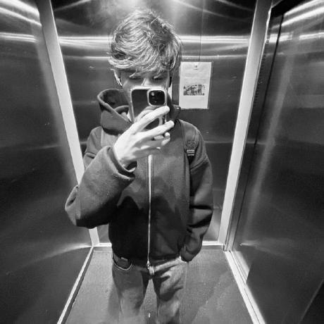

# 🌱 BraTech

Projeto desenvolvido para o **Challenge 2026 da FIAP**, pela turma **1TDSR**, com foco na criação de uma solução digital que utiliza conceitos de **gamificação e sustentabilidade**.

A proposta da BraTech é incentivar os usuários da comunidade **SoulUp** a adotarem ações mais sustentáveis por meio de desafios, pontuações, acompanhamento de progresso e elementos de gamificação.

Nesta Sprint, o projeto foi migrado para **React + Vite + TypeScript**, utilizando uma arquitetura baseada em componentes e navegação no formato **SPA (Single Page Application)**.

---

## 🚀 Tecnologias utilizadas

O projeto foi desenvolvido utilizando:

* React
* Vite
* TypeScript
* React Router DOM
* React Hook Form
* Tailwind CSS
* HTML5
* CSS3
* Git
* GitHub

---

## 📁 Estrutura de pastas

A aplicação está organizada da seguinte maneira:

```text
Gamificacao-BraTech/
│
├── public/
│   └── integrantes/
│       ├── joao.jpg
│       ├── matheus.jpg
│       ├── guilherme.jpg
│       ├── thiago.jpg
│       └── lucas.jpg
│
├── src/
│   ├── components/
│   │   ├── AcaoCard.tsx
│   │   ├── Button.tsx
│   │   ├── Footer.tsx
│   │   ├── Header.tsx
│   │   ├── IntegranteCard.tsx
│   │   ├── Layout.tsx
│   │   └── SectionTitle.tsx
│   │
│   ├── data/
│   │   ├── acoes.ts
│   │   └── integrantes.ts
│   │
│   ├── pages/
│   │   ├── Avatar.tsx
│   │   ├── Contato.tsx
│   │   ├── Faq.tsx
│   │   ├── Gamificacao.tsx
│   │   ├── Home.tsx
│   │   ├── IntegranteDetalhe.tsx
│   │   ├── Integrantes.tsx
│   │   ├── NotFound.tsx
│   │   └── Sobre.tsx
│   │
│   ├── types/
│   │   └── index.ts
│   │
│   ├── App.tsx
│   ├── index.css
│   └── main.tsx
│
├── .gitignore
├── index.html
├── package.json
├── package-lock.json
├── postcss.config.js
├── tailwind.config.js
├── tsconfig.json
├── tsconfig.app.json
├── tsconfig.node.json
├── vite.config.ts
└── README.md
```

### Organização

* **components/** — componentes reutilizáveis da aplicação.
* **data/** — dados utilizados pelas páginas e componentes.
* **pages/** — páginas acessadas através das rotas da aplicação.
* **types/** — interfaces e tipos utilizados pelo TypeScript.
* **public/** — arquivos públicos e imagens utilizadas pelo projeto.

---

## 🖥️ Páginas da aplicação

A aplicação possui as seguintes páginas:

### Home

Página inicial da BraTech, apresentando a proposta principal da solução e permitindo a navegação para as demais áreas da aplicação.

### Sobre

Apresenta informações sobre a BraTech e a proposta desenvolvida para o Challenge.

### Gamificação

Apresenta as ações sustentáveis e o sistema de pontuação utilizado para incentivar a participação dos usuários.

### Avatar

Protótipo de personalização e evolução do avatar do usuário conforme sua participação nas atividades sustentáveis.

### FAQ

Página de perguntas frequentes sobre a solução e seu funcionamento.

### Contato

Formulário de contato desenvolvido utilizando **React Hook Form**, TypeScript e validação dos campos.

### Integrantes

Apresenta os integrantes responsáveis pelo desenvolvimento do projeto.

### Perfil do integrante

Página acessada através de uma **rota dinâmica**, exibindo informações específicas do integrante selecionado.

### Página 404

Página apresentada quando o usuário tenta acessar uma rota inexistente.

---

## 🧩 Principais funcionalidades

Entre as funcionalidades implementadas estão:

* Navegação SPA com React Router DOM;
* Rotas estáticas;
* Rota dinâmica para os integrantes;
* Componentes reutilizáveis;
* Sistema demonstrativo de gamificação;
* Sistema de pontuação;
* Desafios sustentáveis;
* Protótipo de avatar;
* FAQ interativo;
* Formulário com validação;
* Página personalizada para rotas inexistentes;
* Interface responsiva para diferentes tamanhos de tela.

---

## 📱 Responsividade

A interface foi desenvolvida utilizando **Tailwind CSS** e adaptada para diferentes tamanhos de tela.

O projeto considera:

* Mobile — até 480px;
* Tablet — a partir de 768px;
* Desktop — a partir de 992px.

---

## ⚙️ Como executar o projeto

### Pré-requisitos

Antes de executar o projeto, é necessário possuir o **Node.js**

## 👥 Autores e créditos

Projeto desenvolvido pelos alunos da turma **1TDSR — FIAP**.

### João Arthur Maia Almeida

<p align="center">
  
</p>

**RM:** 573458
**Turma:** 1TDSR

**GitHub:**
https://github.com/arthurmaia07

**LinkedIn:**
https://www.linkedin.com/in/jo%C3%A3o-arthur-maia-almeida-927358401/

---

### Matheus Nogueira Quintas

<p align="center">
  
</p>

**RM:** 572542
**Turma:** 1TDSR

**GitHub:**
https://github.com/MatheusQuintasdev

**LinkedIn:**
https://www.linkedin.com/in/matheus-quintass

---

### Guilherme Ribeiro Matias

<p align="center">
  
</p>

**RM:** 573890
**Turma:** 1TDSR

**GitHub:**
https://github.com/GuilhermeRibeiroMatias

**LinkedIn:**
https://www.linkedin.com/in/guilherme-ribeiro-matias-030385349/

---

### Thiago Dias Gomes

<p align="center">
  
</p>

**RM:** 569675
**Turma:** 1TDSR

**GitHub:**
https://github.com/douxz1

**LinkedIn:**
https://www.linkedin.com/in/thiago-dias-a53429315/

---

### Lucas José Paolillo Vasconcelos

<p align="center">
  
</p>

**RM:** 565561
**Turma:** 1TDSR

**GitHub:**
https://github.com/lucas-duy

**LinkedIn:**
https://www.linkedin.com/in/lucas-jose-8903253b6/

## 🎥 Vídeo de apresentação

O vídeo apresenta o funcionamento da aplicação, suas principais páginas, funcionalidades e tecnologias utilizadas.

**YouTube:**
https://youtu.be/XNMRWeqh-hk

---

